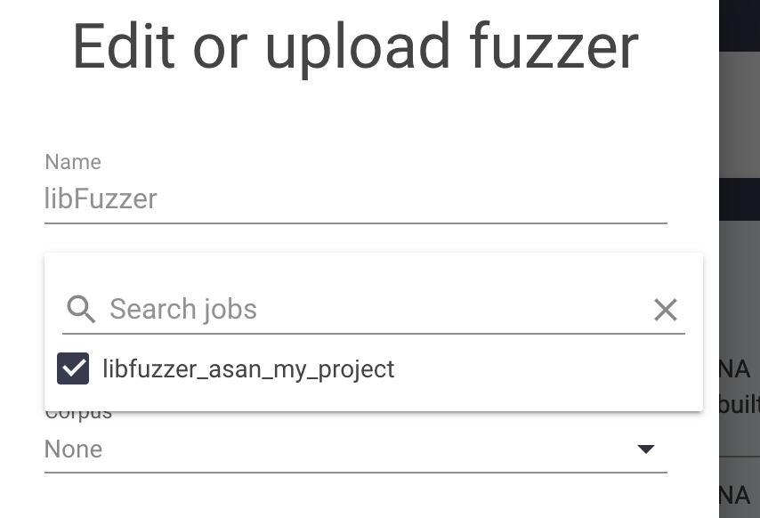
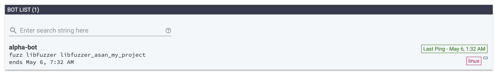
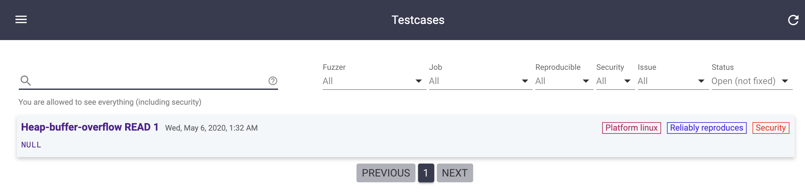
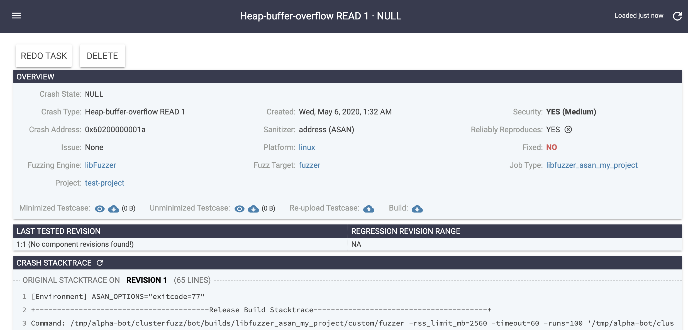

# Getting Started with ClusterFuzz Local in AWS

The information below supplements information you will find in the 3 relevant pages of [the documentation](https://google.github.io/clusterfuzz):

1. [Prerequisites](https://google.github.io/clusterfuzz/getting-started/prerequisites/)
2. [Running a local instance](https://google.github.io/clusterfuzz/getting-started/local-instance/)
3. [libFuzzer and AFL](https://google.github.io/clusterfuzz/setting-up-fuzzing/libfuzzer-and-afl/)

The repo changes fast so some of those steps will be obsolete soon and hopefully for the better.

## Prepare extra dependencies
```
# sudo add-apt-repository ppa:deadsnakes/ppa


sudo apt update -y
sudo apt-get -y upgrade
sudo apt-get install python3.7 zip python3-pip python3.7-dev clang-tools-9
sudo python3.7 -m pip install pipenv
sudo update-alternatives --install /usr/bin/clang++ clang++ /usr/bin/clang++-9 100

sudo update-alternatives --install /usr/bin/python3 python3 /usr/bin/python3.6 1
sudo update-alternatives --install /usr/bin/python3 python3 /usr/bin/python3.7 2


sudo update-alternatives --config python3

# -> Choose [1]

ubuntu@ip-172-30-0-166:~/clusterfuzz$ python3 -V
Python 3.6.9
ubuntu@ip-172-30-0-166:~/clusterfuzz$ python3.7 -V
Python 3.7.7


pushd /tmp
wget https://dl.google.com/go/go1.11.linux-amd64.tar.gz
sudo tar -xvf go1.11.linux-amd64.tar.gz
sudo mv go /usr/local
popd

cat >> ~/.profile
export GOROOT=/usr/local/go
export GOPATH=$HOME/go
export PATH=$GOPATH/bin:$GOROOT/bin:$PATH

source ~/.profile
```

## Standard Install and Run


```
git clone https://github.com/google/clusterfuzz
cd clusterfuzz

local/install_deps.bash
```

Enable AWS IP for uploads - see also [here](https://github.com/google/clusterfuzz/issues/163#issuecomment-624449147):

```diff
diff --git a/local/emulators/gcs.go b/local/emulators/gcs.go
index d2af8a18..fb735030 100644
--- a/local/emulators/gcs.go
+++ b/local/emulators/gcs.go
@@ -254,5 +254,5 @@ func main() {
        flag.Parse()
 
        http.HandleFunc("/", handler)
-       http.ListenAndServe(fmt.Sprintf("localhost:%d", port), nil)
+       http.ListenAndServe(fmt.Sprintf(":%d", port), nil)
 }


diff --git a/src/local/butler/constants.py b/src/local/butler/constants.py
index 87d84b30..68d75e8a 100644
--- a/src/local/butler/constants.py
+++ b/src/local/butler/constants.py
@@ -70,4 +70,4 @@ PUBSUB_EMULATOR_PORT = 9006
 PUBSUB_EMULATOR_HOST = 'localhost:' + str(PUBSUB_EMULATOR_PORT)
 
 LOCAL_GCS_SERVER_PORT = 9008
-LOCAL_GCS_SERVER_HOST = 'http://localhost:' + str(LOCAL_GCS_SERVER_PORT)
+LOCAL_GCS_SERVER_HOST = 'http://<my-public-ip>:' + str(LOCAL_GCS_SERVER_PORT)
```

Make the bot require less storage:

```diff
diff --git a/src/python/build_management/build_manager.py b/src/python/build_management/build_manager.py
index c0b11140..68578337 100644
--- a/src/python/build_management/build_manager.py
+++ b/src/python/build_management/build_manager.py
@@ -58,7 +58,7 @@ BUILD_TYPE_SUBSTRINGS = [
 # Build eviction constants.
 MAX_EVICTED_BUILDS = 100
 MIN_FREE_DISK_SPACE_CHROMIUM = 10 * 1024 * 1024 * 1024  # 10 GB
-MIN_FREE_DISK_SPACE_DEFAULT = 5 * 1024 * 1024 * 1024  # 5 GB
+MIN_FREE_DISK_SPACE_DEFAULT = 512 * 1024 * 1024  # 5 GB
 TIMESTAMP_FILE = '.timestamp'
```

Start the server:

```
pipenv shell

gcloud auth application-default login

# First time
python butler.py run_server --bootstrap

# Afterwards
python butler.py run_server --skip-install-deps

# Run bot
pipenv shell
python butler.py run_bot --name alpha-bot /tmp/alpha-bot &
tail -f /tmp/alpha-bot/clusterfuzz/bot/logs/bot.log &
jobs
```

## 1. Create Fuzzing Target

```
cat > fuzzer.cc

#include <stdint.h>
#include <stdio.h>
extern "C" int LLVMFuzzerTestOneInput(const uint8_t *Data, size_t Size) {
  uint8_t tmp = Data[10];
  return 0;  // Non-zero return values are reserved for future use.
}

clang++ -fsanitize=address,fuzzer fuzzer.cc -o fuzzer

./fuzzer -runs=10

zip fuzzer-build.zip fuzzer

scp -i ~/keys/oregon-key.pem ubuntu@52.13.62.111:fuzzer-build.zip .
```


## 2. Add new Job

```
job name: libfuzzer_asan_my_project
platform: Linux
templates: libfuzzer
           engine_asan
```
attach the `.zip` file


## 3. Route to fuzzer

Assign to the job from the fuzzers tab, by clicking 'Edit' on teh libFuzzer fuzzer and then check the new job.



## 4. Restart the Bot

Restart the bot to pick it immediatelly. You should then see in the Bots page the assignment.



It will take some time but afterwards the crash should be found and added in the Testcases page:



and details:


